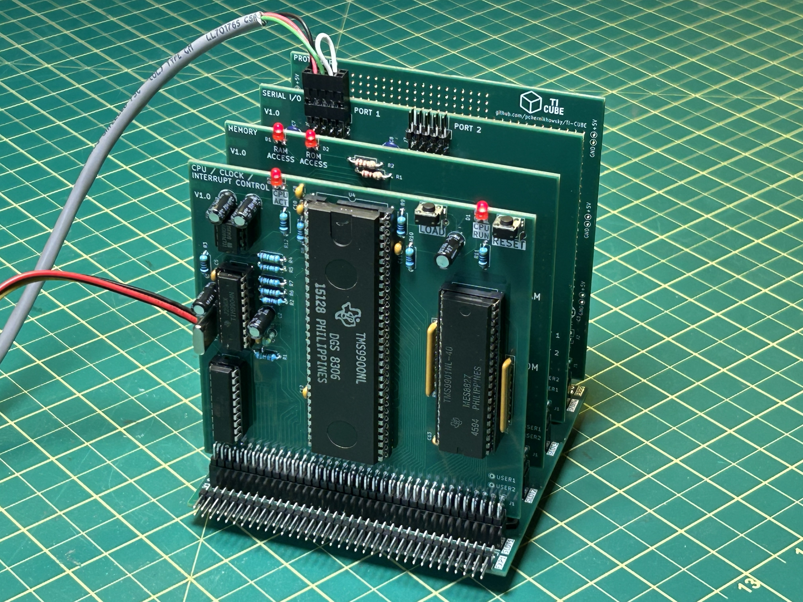

# The TI CUBE

The `TI CUBE` is a homebrew microcomputer I designed based on the Texas Instruments TMS 9900 microprocessor and its associated peripheral devices.

In its basic form the `TI CUBE` supports communications through two serial ports, 32KB of RAM, and 32KB of ROM.

## Why the TMS 9900?

The [TMS 9900 microprocessor](https://en.wikipedia.org/wiki/TMS9900) was relatively advanced for its time (released in 1976) and is essentially a single-chip version of TI's 990 series of 16-bit minicomputers from the 1970s. The TMS 9900 is considered one of the first true 16-bit microprocessors with a full 16-bit external data bus. This was allowed by the use of rather unconventional 64-pin DIP package. The address bus uses 15 bits, but since all memory accesses are 16-bits wide, this provides a 64KB address space (32K of 16 bit words). The most unique feature of the TMS 9900 is that it had no internal registers, other than PC (program counter), WP (workspace pointer), and status register (SR) - all 16-bits wide. Instead of internal registers, the WP pointed to a region in external memory where 16 "registers" were stored in sequential memory addresses. Adjusting the WP allowed for very fast context switching by pointing to a different set of "registers". This capability was used in TI 990 minicomputers to support multiuser computing.

The elegance of the 16-bit bus and the quirkiness of its memory-based registers makes this chip a fascinating way to explore early microcomputer technology and its capabilities.

## Design Philosophy

The following principles guided my development of this homebrew project. The list is roughly in order of priority (highest is first).

1. **No 8-bit data buses!** The TMS 9900 microprocessor is fundamentally a 16-bit design descendent from TI's 990 series of 16-bit minicomputers and I wanted to honour this ancestry as much as possible. I find address/data bus muxing/demuxing unsightly, complex, and inelegant. Yes, the TMS 9900 isn't the fastest of the TMS 99XX series of microprocessors, but it's the only one that supports an **external** 16-bit data bus interface.

2. **Modularity.** Just like a minicomputer which would typically have a backplane populated with multiple cards, the `TI CUBE` uses a similar philosophy with three basic cards: 
   * CPU card (with clock and interrupt control)
   * Memory card (holding the RAM and ROM)
   * Serial port interface card (equipped with two serial chips driving two EIA-232C compatible ports). 
  
   All cards plug into a backplane using 72-pin header connectors. Any card can go in any slot, and multiple cards (e.g., multiple seial interface cards) are supported. Additional backplanes can also be daisy-chained to support additional card slots. The expansion connectors (especially the pin header connector) also makes for handy connections to bus signals for debugging (via a scope or logic analyzer).

3. **Board size.** Constraining the board size to 100 x 100 mm (4 x 4 in) allows ordering PCBs using the [JLCPCB](https://jlcpcb.com) or [PCBWAY](https://pcbway.com) prototyping services (personally, I have had great experience with JLCPCB). This significantly reduces the cost of individual boards (approximately $2 per board). The physical construction also gives the `TI CUBE` its name: four 100 x 100 mm vertical cards plugged into a horizontal four-slot 100 x 100 mm backplane.

4. **Simplicity.** I subscribe to the [Earl Muntz](https://en.wikipedia.org/wiki/Muntzing) philosophy. As such, the `TI CUBE` design uses the minimum required amount of components to accomplish its function. Random logic (i.e., TTL gates and decoders) is complex and consumes significant board space. Instead, I prefer to use simple and standard PLD devices like the ubiquitous 16V8, which does everything needed in one chip. This also allows easily reconfigurability simply by reprogramming the PLD. There are  no address or data buffers in the `TI CUBE`, but the small size combined with the use of four-layer PCBs keeps the digital signals clean; my builds have demonstrated excellent reliablity and performance. 

5. **Period correctness.** Primarily this means use of only through-hole components (no surface mount). I don't mind SMD as such, but through-hole is still easier to assemble and is more typical of 70s/80s computers. I have violated the period-correctness rule in number of other places (e.g., use of PLDs instead of random logic, larger memory ICs compared to what was available in the 70s and early 80s), so this one is more a [guideline than an actual rule](https://www.youtube.com/watch?v=omjnIeLIzJc&t=13s). 😉
   
8. **Compatibility.** I designed the `TI CUBE` to be compatible with other TMS 9900-based systems. One popular example is [Stuart Connor's TMS 9900 breadboard/PCB system](http://www.stuartconner.me.uk/tms9900_breadboard/tms9900_breadboard.htm). In fact, the binary files he provides can be downloaded, burned to EPROMs, and used directly in the `TI CUBE`. This includes the TIBUG monitor and Cortex BASIC!

## Specifications

1. **CPU board** [(photo)](images/CPU.jpg)
-  TMS 9900 microprocessor running at 3 MHz (or 4 MHz if a TMS 9900-40 is used and the appropriate clock changes are made)
-  TIM 9904 or TIM 9904A clock generator[^1]
-  TMS 9901 programmable systems interface (PSI) for interrupt management
-  ATF16V8 PLD for address decoding
-  ICL7660 voltage convertor to generate the -5V power supply needed by the CPU
-  2x red LEDs for CPU RESET signal and CPU activity (driven by the IAQ output) indication
2. **Memory board** [(photo)](images/Memory.jpg)
-  2x EPROMs (e.g., 2764, 27128, 27256) for up to 32 KB of EPROM[^2]
-  2x static RAM (e.g., 55256) for up to 32 KB of RAM[^2]
-  2x red LEDs for RAM and ROM access indication
-  ATF16V8 PLD for address decoding
-  Jumpers to control use of the EPROM A14 address line (or to select the high or low bank)
3. **Serial I/O board** [(photo)](images/Serial_IO.jpg)
-  2x TMS 9902 asynchronous communications controllers (ACC)
-  2x MAX232 interfaces for EIA-232C compatible serial ports
-  2x ATF16V8 PLD for address decoding
-  2x 10-pin 0.1 in header connectors using the AT/Everex standard pinout to connect serial devices
-  Jumpers to allow address and interrupt selection for each TMS 9902
4. **Protoboard** [(photo)](images/Protoboard.jpg)
-  Unpopulated PCB with a large area of plated-through holes for prototyping
-  Optional ATF16V8 PLD for address decoding
5. **Backplane** [(photo)](images/Backplane.jpg)
-  4x 72-pin header sockets which support any combination of the cards above
-  1x 72-pin header socket for daisy chaining multiple backplanes
-  1x 72-pin header pin connector for daisy chaining multiple backplanes
-  2x red LEDs for +5V and +12 power supply indication
-  1x 4-pin Berg connector for +5V and +12V power supplies (compatible with 3.5 in floppy power connector)

# Notes

[^1]: Depending on whether the TIM 9904 or TIM 9904A is used, and which CPU frequency is desired (12 or 16 MHz) different components must be selected for the clock crystal and tank circuit. A table of values is provided in the CPU schematic.

[^2]: The RAM and ROM sizes can be adjusted in any combination that fits within the 64KB address space simply by adjusting the logic for the chip enable outputs in the PLD program.

